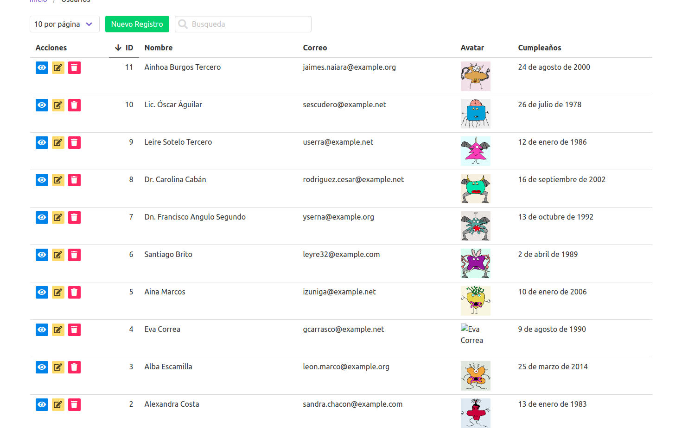

#Prueba Técnica Logikoss

- Clonar este proyecto

- Genera los archivo de **auth**
- Genera una migracion donde añadas 2 nuevos campos `username string unique`  y `avatar string nullable`
- Crea un CRUD de Usuarios implementado el almacenamiento de imagenes para el campo `avatar`
    - Opcional Paginación, Ajax y Busqueda puntos extra


> Referencia del CRUD

- Añade otro modelo `Role` y su migración con la siguiente estructura
```php
<?php

use Illuminate\Support\Facades\Schema;
use Illuminate\Database\Schema\Blueprint;
use Illuminate\Database\Migrations\Migration;

class CreateRolesTable extends Migration
{
    /**
     * Run the migrations.
     *
     * @return void
     */
    public function up()
    {
        Schema::create('roles', function (Blueprint $table) {
            $table->bigIncrements('id');
            $table->string('name');
            $table->timestamps();
        });
        
        Schema::create('user_role', function (Blueprint $table) {
            $table->bigIncrements('id');
            $table->unsignedBigInteger('user_id');
            $table->unsignedBigInteger('role_id');
            $table->timestamps();
        });
    }

    /**
     * Reverse the migrations.
     *
     * @return void
     */
    public function down()
    {
        Schema::dropIfExists('roles');
        
        Schema::dropIfExists('user_role');
    }
}

```
- Crea la relacion 1 usuario puede tener 1 o más roles
    - Opcional crear un trait para tener métodos adicionales en el modelo `User` y facilitar el uso de la lógica de roles
    
- Crear un modelo de `Post` con su migracion

```php
<?php

use Illuminate\Support\Facades\Schema;
use Illuminate\Database\Schema\Blueprint;
use Illuminate\Database\Migrations\Migration;

class CreatePostsTable extends Migration
{
    /**
     * Run the migrations.
     *
     * @return void
     */
    public function up()
    {
        Schema::create('posts', function (Blueprint $table) {
            $table->bigIncrements('id');
            $table->string('title');
            $table->longText('content')->nullable();
            $table->string('image')->nullable();
            $table->string('slug');
            $table->timestamps();
        });
    }

    /**
     * Reverse the migrations.
     *
     * @return void
     */
    public function down()
    {
        Schema::dropIfExists('posts');
    }
}

```
- Generar un CRUD para posts donde apliques una `Policy` y un `Request`, en el controlador implementar la inyeccion de dependencia del modelo y utilizar el campo `slug` como parámetro de busqueda
    - Opcional Implementar carga de imagen en el campo `image` y wysiwyg-editor para el campo `content`
    
- Implementar Pruebas Unitarias para ambos casos y subir tus cambios.

- Puntos extra utilizar componentes de Vue y framework Css diferente a Bootstrap

- Subir todos los cambios en tu fork y compartir el repo.

Se probará en un ambiente con `PHP7.2`, `MySql5.7` bd `laravel` , user `root` pass `secret`  y se ejecutarán los siguientes comandos

```bash
git clone project
```
```bash
cp .env.example .env
```
```bash
composer install
```
```bash
php artisan key:generate
```
```bash
php artisan storage:link
```
```bash
php artisan migrate
```
```bash
npm install
```
```bash
npm run dev
```
- Al finalizar subir el proyecto a un repositorio publico en tu cuenta de github.
